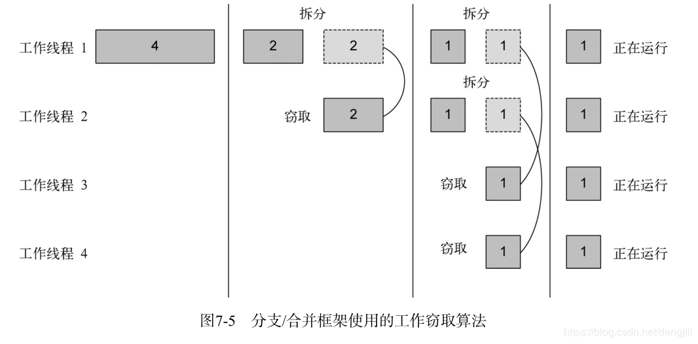
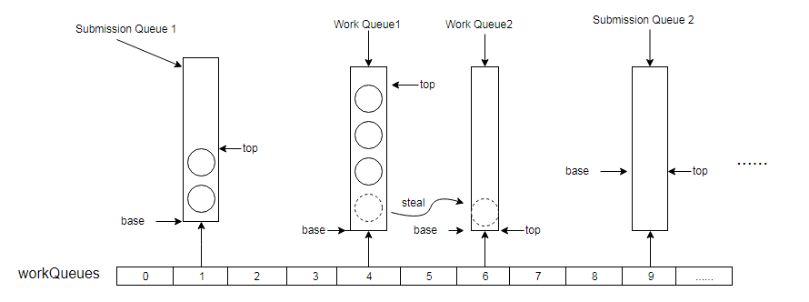

#JDK 7 新特性整理

##1 官方文档
>https://www.oracle.com/technetwork/java/javase/jdk7-relnotes-418459.html

##2 不用怎么关心的改动

###2.1 SWING
在JDK1.7中，对GUI进行了极大的改善，支持了3D，提升了性能，让Java制作图形化界面从不可能变成可能。

比如大家再用的Jetbrains Idea就是完全基于SWING制作的

不过我相信大家应该不会从事这方面的开发，所以感兴趣的自己去了解一下哈

官方文档：

>https://docs.oracle.com/javase/7/docs/technotes/guides/swing/enhancements-7.html

###2.2 网络增强

>The URLClassLoader.close method has been added. 

增加了这么一个方法，说实话Java关于网络请求方面已经有很多很好用的包了，比如Requests/Jsoup/Hutool，所以这个我也不是很关心

###2.3 安全性增强

对加密算法/SSL/TSL等作了诸多增强，详情参考官方文档

>https://docs.oracle.com/javase/7/docs/technotes/guides/security/enhancements-7.html

###2.4 Rich Internet Applications (RIA)

跟applet有关的一些增强

>https://docs.oracle.com/javase/7/docs/technotes/guides/jweb/clientJRECapabilitiesCheatSheet.html

###2.5 Java 2D

图形化能力增强

>https://docs.oracle.com/javase/7/docs/technotes/guides/2d/enhancements70.html

###2.6 Java XML

Java解析XML方面的增强

>https://docs.oracle.com/javase/7/docs/technotes/guides/xml/enhancements.html

###2.7 Internationalization 

国际化方面的增强，增加了多个字符集支持

>https://docs.oracle.com/javase/7/docs/technotes/guides/intl/enhancements.7.html

###2.8 Multithreaded Custom Class Loaders

消除了在多线程环境下的非层次话类加载时导致的潜在死锁

>https://docs.oracle.com/javase/7/docs/technotes/guides/lang/cl-mt.html

##3 重点关心的改动

###3.1 IO & NIO

NIO大家应该都耳熟能详了，NIO就是New IO，是Java对IO操作更全面的支持，是本次更新之中的重中之重。

由于本人水平和篇幅所限，没办法展开说，建议看源码/API文档，或者下面这个我认为比较好的译文来学习。

> https://ifeve.com/java-nio-all/

###3.2 fork/join 模型

ForkJoinPool这个类是JDK7后新增的线程池，很适合在单机多核的PC上部署多线程程序。

Fork/Join 模式有自己的适用范围。如果一个应用能被分解成多个子任务，并且组合多个子任务的结果就能够获得最终的答案，那么这个应用就适合用 Fork/Join 模式来解决.

ForkJoinPool的核心思想是工作窃取：

>假如我们需要做一个比较大的任务，我们可以把这个任务分割为若干互不依赖的子任务.
>
>为了减少线程间的竞争，于是把这些子任务分别放到不同的队列里，并为每个队列创建一个单独的线程来执行队列里的任务，线程和队列一一对应。
>
>比如A线程负责处理A队列里的任务。
>
>但是有的线程会先把自己队列里的任务干完，而其他线程对应的队列里还有任务等待处理。
>
>干完活的线程与其等着，不如去帮其他线程干活，于是它就去其他线程的队列里窃取一个任务来执行。
>
>而在这时它们会访问同一个队列，所以为了减少窃取任务线程和被窃取任务线程之间的竞争，通常会使用双端队列，被窃取任务线程永远从双端队列的头部拿任务执行，而窃取任务的线程永远从双端队列的尾部拿任务执行。
                       
工作窃取算法的优点是充分利用线程进行并行计算，并减少了线程间的竞争。

其缺点是在某些情况下还是存在竞争，比如双端队列里只有一个任务时。并且消耗了更多的系统资源，比如创建多个线程和多个双端队列。

>如图，提交队列位于哈希数组workQueue的奇数索引槽位，工作线程的工作队列位于偶数槽位，工作线程将分解的子任务推入工作队列的top端，取任务的时候也从top端取（凡是双端队列都会有两个分别指向队列两端的指针，这里就是图上画出的base和top），而当某些工作线程的任务为空的时候，就会从其他队列（不限于workQueue，也会是提交队列）窃取（steal）任务，如图示拥有workQueue2的工作线程从workQueue1中窃取了一个任务，窃取任务的时候采用的是先进先出FIFO的策略(即从base端窃取任务)，这样不但可以避免在取任务的时候与拥有其队列的工作线程发生冲突，从而减小竞争，还可以辅助其完成比较大的任务。

### 3.3 新语言特性

####3.3.1 Binary Literals

数字类型（byte，short，int，和long）也可以使用二进制数字系统中表达。要指定二进制文字，请在数字前添加前缀0b或0B。以下示例显示二进制文字：

    //一个8位的'byte'值：
    byte aByte =（byte）0b00100001; 
    
    //一个16位的'short'值：
    short aShort =（short）0b1010000101000101;
    
 ####3.3.2 switch 支持 String 类型的条件
 
 这个大家应该都用的很多了，不细说了
 
    switch (dayOfWeek) {
             case "Monday":
                 break;
             default:
    }
 
####3.3.3 try-with-resources

以前在关闭资源的时候很麻烦，尤其是资源本身开启/关闭时会抛异常的时候。在Java7以后实现的更优雅了。
 
####3.3.4 同时捕获多个异常

从前：

    catch (IOException ex) {
         logger.log(ex);
         throw ex;
    } catch (SQLException ex) {
         logger.log(ex);
         throw ex;
    }

现在：

    catch (IOException|SQLException ex) {
        logger.log(ex);
        throw ex;
    }

#### 3.3.5 数字显示增强

可以在数字类型的任意地方加任意数量的下划线，以增强阅读

    long creditCardNumber = 1234_5678_9012_3456L;
    long socialSecurityNumber = 999_99_9999L;
    float pi = 	3.14_15F;
    long hexBytes = 0xFF_EC_DE_5E;
    long hexWords = 0xCAFE_BABE;
    long maxLong = 0x7fff_ffff_ffff_ffffL;
    byte nybbles = 0b0010_0101;
    long bytes = 0b11010010_01101001_10010100_10010010;

#### 3.3.6 类型推断

这个一般ide给我们做了

从前：

    Map<String, List<String>> myMap = new HashMap<String, List<String>>();

现在：

    Map<String, List<String>> myMap = new HashMap<>();

#### 3.3.7 增强类型擦除时的检查

    List l = new ArrayList<Number>();
    List<String> ls = l;       // unchecked warning
    l.add(0, new Integer(42)); // another unchecked warning
    String s = ls.get(0);      // ClassCastException is thrown

### 3.4 JVM

#### 3.4.1 JVM增加对非Java语言的支持

个人猜测是如Kotlin、Scala、Groovy、JRuby、Jython、Clojure、Clojure、Eta、Haxe这样的语言

#### 3.4.2 Garbage-First (G1) 垃圾回收器

G1是作为并发标记扫描收集器（CMS）的长期替代产品，好像在后面的Java11和Java14又被取代了，学到那的时候再补充。

>G1垃圾回收过程主要包括三个：
>
>年轻代回收（young gc）过程
>老年代并发标记（concurrent marking）过程
>混合回收过程（mixed gc）。
>应用程序分配内存，当年轻代的Eden区用尽时开始年轻代回收过程；当堆内存使用达到一定值（默认45%）时，开始老年代并发标记过程；标记完成马上开始混合回收过程。

具体的内容建议阅读《深入浅出JVM虚拟机》

#### 3.4.3 Java HotSpot 性能增强

增强了个平台虚拟机的性能
 
#### 3.5 JDBC

Java数据库连接（JDBC）API提供了来自Java编程语言的通用数据访问。

 